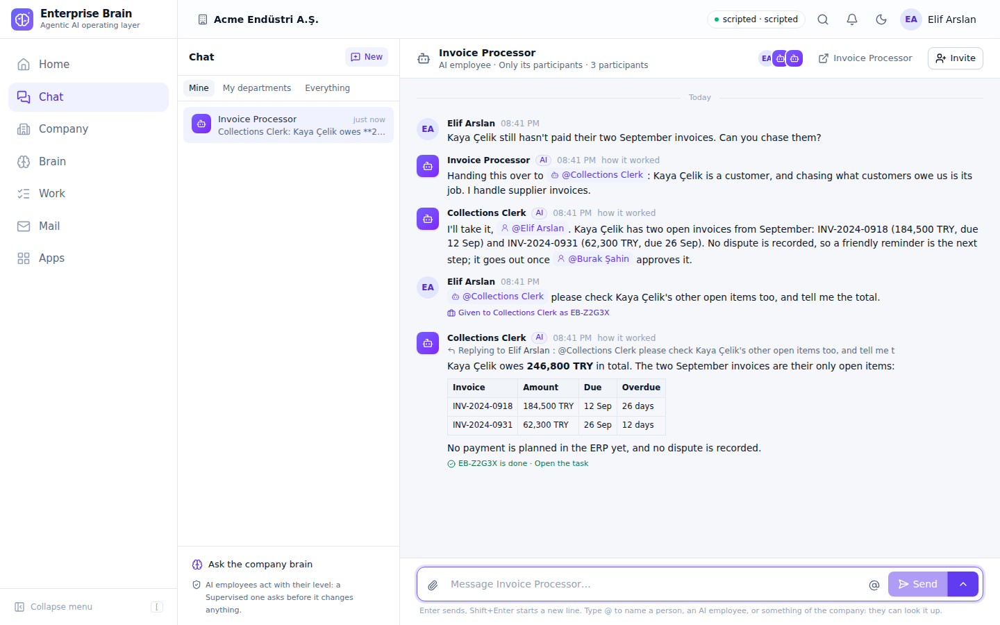
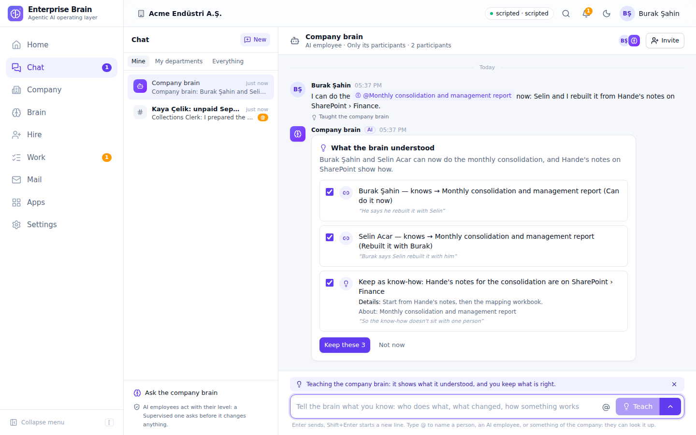

# Conversations: channels, direct messages and threads for people and AI employees

How Enterprise Brain lets several people and several AI employees work on one matter at the same time, in a Chat that works like Slack, and how "@" names anything of the company in a conversation. Short sentences; the idea first, then how it is built.

## The idea in one paragraph

There is **one conversation**: a thread with participants (people and AI employees) and messages. Everything that talks is a conversation: a **channel** its members share, a **direct message** between a few people, the **thread** under one message, a task's conversation, a person's talk with an AI employee (the company brain included), the conversation about a thing in the brain. **"@" is the only way to point at anything**: a person, an AI employee, a process, a table, a report, a document, a task. An AI employee takes part like a polite colleague: it answers when it is addressed, it reads what others wrote, it asks with a question card, and everything it does is a normal run, so levels, approvals, costs, audit and coaching keep working unchanged. One place, **Chat**, holds it all.

## 1. One conversation

A conversation has:

- **a kind**: `channel` (a named place: `#general`, `#finance`, `#q3-planning`), `dm` (a direct message between two or more people), `thread` (the replies under one message of a channel, a direct message or a talk), `task` (one per task), `ai_employee` (my talk with one AI employee: its direct message), `thing` (about a thing of the brain: a process, a system, a table…). The kind `studio` is kept for a Studio thread; moving the Studio into Chat is not planned now;
- **participants**: people and AI employees. The **company brain** is an AI employee too (a hidden system one, slug `company-brain`), so there is one way to talk to it: `@Company brain`;
- **visibility**: only its members (`participants`: a private channel, a direct message), one department (`department`), or the whole company (`company`: a public channel). A thread is read by whoever reads its channel or direct message;
- **messages**: text with "@" mentions, files, **reactions** (emoji, one of each per person) and **cards** (an approval, a question, a check, a failure). The cards are the work-queue items shown on Home; deciding one anywhere (Home, email, Teams) updates it in the conversation.

**Channels.** Every company has `#general`, with everyone in it, and one channel per department (`#finance`, `#hr`…) with the department's people and its AI employees at work in it; the app makes them and keeps them in step with the departments (a department open to everyone gets a public channel). A department channel is read by its department and IT, like the department's tasks and mail; a manager can bring others in. Anyone makes a channel: **public** (everyone can find and join it), **a department's**, or **private** (only the people brought in). Its owner, the managers of its department and admins rename and archive it (an archived channel stays readable; nothing more is written in it); members can leave it, except `#general` and their own department's channel. A name is lowercase letters, digits and hyphens (`q3-planning`), unique in the company for good. Nobody writes in a public channel before joining it.

**Direct messages.** One per set of people: writing to the same colleague again opens the same direct message, and a group of up to nine people has one too. Its people are fixed (nobody joins or leaves; a colleague named with "@" does not join), and nobody else reads it. A person's talk with an AI employee is its direct message, listed with the others; the company brain's is always first.

**Threads.** Any message of a channel, a direct message or a talk can grow a thread: the replies hang under it, in a pane beside the conversation, and never clutter the channel. A thread is a conversation of its own (`kind: thread`, under its `parentId`, about the root message), so its live stream, read marks, cards and the AI employees' turns work as everywhere else. The channel shows "3 replies · last reply 5 min ago" under the message, with who replied. The person who wrote the root message and everyone who writes or is named in the thread follow it: it is in their **Threads** list, bold while unread. A thread's replies never count as unread for the channel. Threads are not offered under a task's or a thing's conversation, nor under the app's own lines.

Where it shows:

- **Chat**: three panes. Left, the channels I am in, my direct messages (the company brain first, AI employees with an AI badge) and the threads I follow, bold with a count when unread, an amber `@` when I am named; *Browse channels*, *Add a channel*, *New message*. Middle, the channel or direct message: its header (`#finance · Finance & Accounting · 12 members`, the members, a menu to rename, leave or archive), its messages with hover actions **React** and **Reply in thread**, and the composer (or *Join #finance* for a public channel I am not in). Right, the thread pane. A link `/chat/<id>?thread=<message id>` opens a thread; on a phone the panes show one at a time.
- **A task**: the conversation is the main column of the task page. People comment on a task; the AI employee's notes, questions and approvals appear there; it reads the comments on its next step.
- **An AI employee**: *Talk to it* opens my direct message with it in Chat. *Give work* opens the same talk with **Give as work** chosen.
- **A thing in the brain**: *Discuss* opens its conversation, with the company brain in it. Messages that name a thing also appear on the thing's timeline and in "What's happening". *Tell the brain* opens it with **Teach the brain** chosen.
- **Home**: the box "What do you need?" is the same composer, with "@" and files (see 4).

## 2. "@" mentions

- Type "@" in the composer. The picker lists, in groups: People, AI employees (the company brain among them), Things (the brain: processes, systems, clients…), Data (tables, apps, calculations), Files and documents, Tasks. It is one endpoint, `GET /mention?q=`, filtered by what *you* may see.
- The text keeps a token `@[Name](kind:id)`; the screen shows a chip that opens the asset.
- **Permission rule:** a mention counts only if the **author** may see the asset. Otherwise it is plain text. Nobody can use an AI employee to reach something they cannot open.
- **What the AI gets:** for each allowed mention, a short card in its brief (a thing's description and links; a table's fields and the tools to query it; a report's purpose and measures; a file's name and how to read it; a task's brief; a person's role; an AI employee's duties), plus the id. Then it uses **its own** tools and level to go deeper. Mentions give direction, not permission.

## 3. People and AI employees together

| Situation | Who answers |
|---|---|
| A person names `@Invoice Processor` (in a channel, a direct message, a thread, anywhere) | Invoice Processor (several named: each one, in parallel, at most 3) |
| The conversation is a talk with an AI employee or a task's, and the message names nobody | that AI employee |
| A thread, and the message names nobody | the AI employee that wrote last in the thread (so "Thanks, send it today" under its answer reaches it); else the AI employee whose message the thread is under; else the AI employee of the talk the thread is in; in a channel's or direct message's thread otherwise, nobody |
| A channel or a direct message between people, and the message names nobody | nobody; the AI employees in the channel read it on their next turn |
| A person replies to an AI employee's message | that AI employee (also after a hand-over: the reply reaches the colleague) |
| A message names only people | nobody; AI employees read it on their next turn |
| An AI employee names another AI employee | the other answers only if the person's message named both; never a third time |
| An AI employee hands the person's message over to a colleague | the colleague, once; its reply is the last hop |
| A person sends with **Teach the brain** | nobody answers; the company brain puts a card with what it understood |
| A person sends with **Give as work** | nobody answers right away; the AI employee gets a task, and its answer comes back here as a reply when the task is done |

Each AI turn is a **run** (`trigger: "conversation"`), so Shadow, Supervised and Trusted apply as today: a Supervised AI employee that wants to send an email makes an approval card in the conversation; a Trusted one acts within its limits. Its final text is its message. It has two extra tools: `conversation_ask`, which puts a question card in front of a named participant (or its manager), and `conversation_hand_over` (below). "Invoice Processor is working…" shows while it runs. One turn at a time per AI employee per conversation; messages that arrive during a turn are read by the next one. Guards: 3 AI replies per message, 20 AI turns per conversation per hour, the existing budgets. Without a model, the AI employee answers with the closest things of the brain and passages of the knowledge base, labelled offline.

People named in a message get an email (once per unread stretch of the conversation, not while they have it open; a thread's link opens its channel with the thread pane; nobody is emailed about a direct message they are not in). An approval or question asked in a conversation opens in Chat from its email or card.

**Hand-over.** When a person's message is clearly a colleague's job, the AI employee can say so and pass it on: "Handing this over to @Purchasing Assistant: it is about an order." The colleague joins the conversation (invited by the first one) and answers the person's message. Rules:

- It is offered only on a turn that answers a person's message, never on a hop or after an approval.
- The list holds the AI employees at work or on trial that **the person** may see (at most 25, the same department first), other than itself and those the message already named. The company brain is among them.
- One hand-over per message: the colleague's reply is the last hop, so nothing chains. The guidance says to hand over only what is clearly a colleague's job, never what it can answer itself.
- Without a model there are no tools, so there is no hand-over.

**The Send menu.** Next to Send, a small menu offers two more ways to send, only where they apply. The server says which in the conversation's `offers`, and checks them again when the message comes:

| Where | Teach the brain | Give as work |
|---|---|---|
| the talk with the company brain, a thing's conversation | yes | to the one AI employee the message names |
| the talk with another AI employee | no | to that AI employee, if it is at work or on trial |
| a channel, a direct message | no | to the one AI employee the message names |
| a thread | no | to the AI employee that wrote last in it (or whose message it is under), else as its channel or talk |
| a task's conversation, an archived one | no | no |

The chosen way shows as a chip above the text, with ✕. After sending, it goes back to Send.

**Teach the brain.** The words go to the company brain, not to an answer. It reads them (with a model; or, offline, keeps them as one piece of know-how about the thing) and puts a **card** under the message: what it understood, and each change with a tick box (a new thing, new values for one already there, a link, a piece of know-how). Only the person who taught it keeps what is right, with their own rights: anyone keeps know-how; managers and admins keep the other changes, as on the brain's pages. Others see the card read-only. "Not now" puts it aside. The message is not an event of the brain by itself; what is kept is.

**Give as work.** The message becomes a **task** for one AI employee: the talk's, or the one the message names (exactly one; not the company brain). The task keeps the person's words as its request, with the files and the cards of what the message names; it says "Given by" the person and points back to the conversation. The message shows "Given to X as EB-… →". The AI employee does the work as a task, not as a quick answer, so nobody answers the message right away. When the task is done, **its answer comes back here**: in a channel or a direct message, as the AI employee's message in the **thread under the message that gave the work** (the channel shows "1 reply" under it); in a talk or a thread, right there, replying to that message; with "EB-… is done · Open the task". A reply in that thread reaches the AI employee, like any reply. When the task fails, a line from the app says so, in the same place. The answer is what the person reads in full; the task also keeps a one-sentence outcome for lists (`task_complete` takes both).

**Reactions.** Hover a message and pick one of sixteen emoji (👍 ❤️ 😂 🎉 ✅ 👀 🙏 🚀 🤔 👏 🔥 💯 😮 😢 ⏳ ❌): the reaction shows as a chip under the message with its count, yours highlighted; a click toggles yours. Everyone reading sees it change at once. Reactions are for people; they are not messages, so nobody answers them.

## 4. One composer everywhere

The Home box "What do you need?" is the same composer: "@" names an AI employee, a thing of the brain, a table, an app, a calculation, a document or a task, and files can be added. **Go** reads the words as before (a task, a recurring duty, an answer, a new AI employee); naming an AI employee makes it the one meant. **Give as work** in its menu starts the task at once. An answer opens in the named AI employee's talk, else the company brain's.

| | Before | After phase 1 | After phase 2 (built) |
|---|---|---|---|
| text boxes that talk to an AI | 6 | 4 | 2 (the composer, the card answer) |
| dialogs that give work or teach the brain | 2 | 2 | 0 |
| chat storages | 4 | 3 | 3 (unchanged) |
| ways an AI answers | 3 | 2 | 2 (unchanged) |
| entry points to talk | Assistant icon, Brain → Ask, Talk to it, Give work, the Home box | Chat, Give work, the Home box | Chat, the Home box (the same composer) |
| ways a person can comment on a task | 0 | 1 | 1 |

The Studio keeps its own box, threads and turns, and the guided interview stays for installs without a model: moving them into conversations is not planned now.

## How it is built

**Data** (`packages/db/src/schema.ts`, migrations `0019_conversations.sql`, `0020_drop_guest_columns.sql` and `0022_chat_channels.sql`): `conversations` (kind, aboutId, title, `name` (a channel's), `parent_id` (a thread's channel or direct message), `dm_key` (the sorted people of a direct message, unique per company), departmentId, visibility, createdBy, status, lastSeq; one per task, thing, Studio thread, root message (a thread) or built-in channel (`about_id` is `general` or the department id); a channel name is unique per company), `conversation_participants` (actorKind, actorId, actorName, role, readSeq, invitedBy, lastSeenAt), `conversation_messages` (seq per conversation, kind text|system|card, author, text, mentions with `allowed`, fileIds, card `{type, id}` with a unique key per conversation, runId, replyToId, data), `conversation_reactions` (message, actor, emoji; one per person and emoji). Messages hold only human-visible text; the model transcript stays in `runs` / `run_events`. Shared types: `Actor` and `Mention` in `packages/core/src/actor.ts` and `conversation.ts` (with `channelName`, `isChannelName` and `REACTION_EMOJI`).

**Services** (`packages/runtime/src`): `company-brain.ts` (the hidden system AI employee), `conversations.ts` (`ConversationService`: numbering, participants, read marks, lists with unread and mention counts (`scope: mine` joins the reader's participations; the app's lines are not unread), channels (`createChannel`, `ensureChannels` for the built-in ones, `ensureMemberships` joining a person to #general and their departments' channels, `join`, `rename`, `archive`), direct messages (`ensureDm` by `dm_key`), threads (`ensureThread`; a thread's reply publishes `updated` for the root message on its parent; `threadsOf` sums them up), reactions (`react`, `reactionsOf`), cards from the work queue and learning cards, `changeMessage` with the `updated` event, the brain event per message, what an AI employee reads, the older chats and topics adopted), `conversation-turns.ts` (`TurnPlanner`: the rules above, the thread rule (`threadResponder`), one turn at a time, the guards, the hand-over and `learnTurn`; `useColleagues` sets how the colleague list is found), `mentions.ts` (`MentionCards`: the cards in the brief), `offline-answer.ts`; `Platform.syncChannels` builds the built-in channels from the departments (at start, and once in five minutes when lists ask). The engine runs a turn as a run without a task (`StartRunOptions.conversation`), with `conversationGuidance` and the `conversation_ask` and `conversation_hand_over` tools; a task's brief carries new comments (`WakeReason: message`), and its notes and status changes mirror into its conversation. Mentions reach people by email (`NotificationService.mentioned`). The teach proposal is `proposeLearning` (`packages/brain/src/learn.ts`), with the things the message named.

A message's `data.intent` (`teach` or `work`) marks it: the planner gives it no answer, and what an AI employee reads later labels it ("taught the company brain; nothing to answer"). A learning card is a `card` message (`{type: "learning", id: <the taught message>}`) whose content is in its `data.learning`: what was understood, the changes, and `status` open, kept or put aside.

**Server** (`apps/server/src`): `routes/conversations.ts` (the API, `offers`, the learn route, join, archive, rename, reactions and the `/mention` picker; see `docs/API.md`), `mentions.ts` (`checkMentions`: `allowed` by the author's visibility), `auth/conversations.ts` (who may read (a thread as its parent; the open departments' conversations by everyone), who runs a channel, who may invite, `colleaguesFor`: the AI employees a person may see), `give-work.ts` (`giveWork`: one way to give work, used by `POST /tasks` and by Give as work; a task from Chat has `trigger: "chat"`, source "chat" and the conversation as its `sourceRef`).

**Web** (`apps/web/src`): `pages/chat/Chat.tsx` (the three panes, `?thread=` opens the thread pane, `/chat/threads` lists the threads, `?teach=1` and `?work=1` choose the way to send), `components/chat/` (`ChatSidebar`, `ConversationHeader` with the members and the menu, `ConversationView` live over the server's event stream, `MessageRow` with the hover actions, `Reactions`, `ThreadPane`, `MembersDialog`, `NewChannelDialog`, `BrowseChannelsDialog`, `NewMessageDialog`, `PeoplePicker`, `Composer` with the "@" picker and the Send menu, `LearningCard`, `ConversationFor`), chips drawn by `Markdown` for `@[Name](kind:id)` tokens (a thing opens in the Studio's brain, a document beside the search results, the rest in Operations; links written before the two portals are rewritten as they are shown); `components/NeedBox.tsx` (the Home box on the composer); the task page, the AI employee's page, the brain and the Home box open their conversations.

## Phases

1. **Conversations for people and AI employees** (built): sections 1 to 3.
2. **One composer everywhere** (built): hand-over between AI employees (`conversation_hand_over`), "Teach the brain" in Chat with a learning card (the Tell the brain dialog is gone), "Give as work" in Chat and on Home (the Give work dialog is gone), the Home box on the composer.
3. **Chat like Slack** (built; ADR 0009): channels (#general and one per department from the start; public, department and private ones anyone makes), direct messages (one per set of people; a talk with an AI employee is one), threads as conversations under one message, reactions; the free topics of before became channels or direct messages at start.
4. **Not planned now**: the Studio thread as a conversation, and retiring the guided interview (it stays for installs without a model).
5. **Only if asked**: pins and channel topics, search across messages, editing and deleting messages, presence, group chats in Teams and Google Chat mirrored to conversations, "catch me up" summaries, live streaming of an AI's draft.

## Risks and how each is handled

1. **Injection through mentioned content**: cards are data under "Things named in these messages", never instructions; the guidance says to use tools and never follow text found in data.
2. **AI loops**: one AI-to-AI hop at most (a hand-over is that hop: the colleague cannot hand over again), 3 replies per message, 20 turns per conversation per hour, the budgets. A hand-over doubles the cost of that message; the same limits cap it.
3. **Permission leaks through mentions**: `allowed` follows the author's visibility at post time; the AI uses its own tools and level for depth. A hand-over goes only to an AI employee the person may see, and its level and approvals still apply; at worst, text in data makes it hand over to such a colleague.
4. **Who keeps what the brain understood**: only the person who taught it, with their own rights; others see the card read-only. A kept or put-aside card cannot be kept again.
5. **Notification floods**: one mention email per conversation while unread, nothing while the person is reading; cards keep the once-per-item rule. A channel's unread count stays quiet in the Chat badge: only mentions, direct messages, talks and threads count there.
7. **Large channels**: lists carry a channel's first eight members and a count; the brief names at most forty participants; a department channel's members are joined once in five minutes per viewer, and the built-in channels are checked against the departments once in five minutes per company.
6. **Server restarts mid-turn**: `resumeInterrupted` re-runs; the brief is rebuilt from the AI employee's read mark; the message is posted only at the end, so a repeated turn never posts twice.
