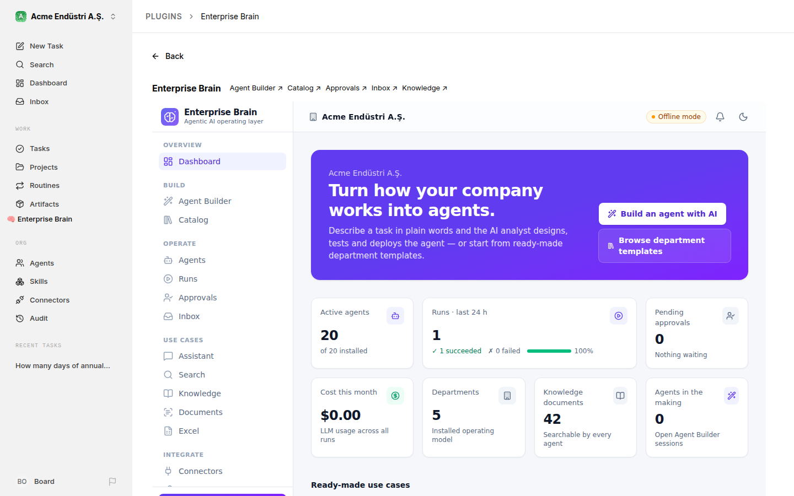
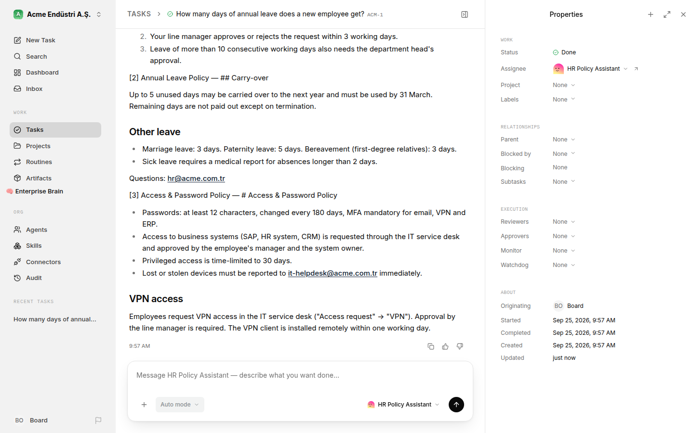

# Using Enterprise Brain with Paperclip

[Paperclip](https://github.com/paperclipai/paperclip) is the control plane for companies of AI agents: org charts, goals, tasks, heartbeats, budgets and governance. By design it doesn't run agents, and knowledge, chat and special surfaces belong in extensions. Enterprise Brain is that extension for enterprises. It supplies the departments, processes, specialist agents, enterprise connectors, knowledge base and Agent Builder, and plugs into Paperclip at four points, **without forking it**.

| # | Integration point | Paperclip mechanism | What you get |
|---|---|---|---|
| 1 | **Company package** | `agentcompanies/v1` import (`paperclipai company import`, `companies.sh`) | Departments become projects and department-lead agents; specialists become employees; scheduled processes become routines; plus the `enterprise-brain` skill |
| 2 | **Hermes gateway** | Built-in `hermes_gateway` adapter | Paperclip heartbeats run Enterprise Brain agents synchronously, with streamed progress, output, token usage and cost |
| 3 | **Plugin** | Plugin system: tools and UI slots | Every Paperclip agent can search company knowledge, run specialists and list approvals; an "Enterprise Brain" page and a dashboard widget appear inside Paperclip |
| 4 | **MCP server** | Remote MCP connections / tool gateway | Governed access to Enterprise Brain's connectors (SAP, Salesforce, sandbox ERP/CRM…) and knowledge from any agent |

Tested against Paperclip 0.3.1 (see [What was verified](#what-was-verified)).

## The bundle: Paperclip and Enterprise Brain in one command

The quickest way to get the Paperclip experience with Enterprise Brain inside it. Requirements: Docker.

```bash
docker compose up -d
```

| Open | What you get |
|---|---|
| http://localhost:3100 | **Paperclip**: your company's org chart with the CEO, department leads and Enterprise Brain agents; tasks, budgets, governance; the **Enterprise Brain** page in the sidebar |
| http://localhost:3200 | The **Enterprise Brain** console |



On first start, which takes a few minutes:

1. PostgreSQL with pgvector starts. A setup step creates Paperclip's database and generates its secrets once, in Paperclip's data volume (`docker/paperclip-setup.sh`).
2. Paperclip starts from its official image (`ghcr.io/paperclipai/paperclip`), in its no-login local mode, as `npx paperclipai onboard` does on a laptop.
3. Enterprise Brain starts, creates the demo company and **connects itself** (`EB_PAPERCLIP_AUTOCONNECT`). It waits until Paperclip answers, then:
   - pushes the company: the org chart with 26 agents, each Enterprise Brain agent with its own Paperclip key;
   - installs the Enterprise Brain plugin, which it copies to a volume both apps share;
   - points the plugin at itself for the company.

The console's Paperclip page shows the progress, then **Connected to Paperclip automatically**. Later starts change nothing that already exists, so a restart doesn't create a second company. After an Enterprise Brain upgrade (`docker compose up -d --build`), the plugin in Paperclip is updated too. If Paperclip's data is reset, the company is pushed again.

Then, in Paperclip, create a task and assign it to an Enterprise Brain agent, for example the *HR Policy Assistant*. Paperclip wakes the agent; it works in Enterprise Brain, answers on the task and closes it:



**How it fits together.** The two apps share one network, like containers in a Kubernetes pod, so `localhost` means the same place to both of them and to your browser:

```text
   your browser ── localhost:3100 ──► gateway ──► Paperclip (127.0.0.1:3100)
                └─ localhost:3200 ─────────────► Enterprise Brain (:3200)
   Paperclip ── hermes_gateway ──► http://localhost:3200/api/hermes    (agents at work)
   Paperclip ── plugin worker ───► http://localhost:3200               (agent tools; the page loads it in your browser)
   Enterprise Brain ─────────────► http://127.0.0.1:3100               (push, plugin, task status)
   both ──► PostgreSQL (databases enterprise_brain and paperclip)
```

This is what makes it work with no settings. Paperclip's no-login mode listens only on 127.0.0.1, and its Hermes adapter accepts plain HTTP only to localhost. The small `gateway` container (socat) forwards the browser to Paperclip. The ports are published on this machine only (`127.0.0.1`), so nobody else on the network can open the unauthenticated Paperclip board or console.

**Settings**, all optional, in a `.env` file next to `docker-compose.yml`:

| Variable | Default | |
|---|---|---|
| `ANTHROPIC_API_KEY` | – | Claude for Enterprise Brain; also passed to Paperclip for its own agents |
| `PAPERCLIP_PORT`, `EB_PORT` | `3100`, `3200` | Ports on this machine |
| `PAPERCLIP_IMAGE` | `ghcr.io/paperclipai/paperclip:latest` | Pin a Paperclip version |
| `EB_PAPERCLIP_AUTOCONNECT` | `true` | `false` to connect by hand (console → Paperclip → Push) |
| `POSTGRES_PASSWORD` | `brain` | The database isn't published outside Docker |

**Data** lives in Docker volumes: `pgdata` (both databases), `braindata` (Enterprise Brain's files and keys), `paperclip-data` (Paperclip's files and secrets) and `eb-plugin`. `docker compose down` keeps them; `docker compose down -v` deletes everything.

**Paperclip's own agents** (the CEO and department leads) need a runtime to plan and delegate. In Paperclip, open an agent and pick one, such as Claude Code (`claude_local`, installed in Paperclip's image; set `ANTHROPIC_API_KEY`). Enterprise Brain agents need nothing more.

### Running the bundle on a server

The bundle is for one machine, like a local Paperclip. On a server that other people use, Paperclip must run in its login mode (`authenticated`). Enterprise Brain then needs a Paperclip board key to connect, and the apps need HTTPS:

- Run Paperclip as its [Docker guide](https://github.com/paperclipai/paperclip/blob/master/doc/DOCKER.md) describes (`PAPERCLIP_DEPLOYMENT_MODE=authenticated`) and claim the instance in the browser.
- Give Enterprise Brain a board API key as `PAPERCLIP_API_KEY`. Paperclip issues board keys through its browser approval flow (`paperclipai auth login`); they expire after 30 days.
- Serve both apps over HTTPS, set `EB_PUBLIC_URL` to Enterprise Brain's address and `EB_API_KEY` for its console, and add that key as the plugin's API key secret in Paperclip.

Automating this (Enterprise Brain asking for approval in Paperclip's browser flow, and renewing its key) is the next step and not built yet.

## The Hermes key

Paperclip authenticates to Enterprise Brain with a shared secret: the **Hermes key**. It is not issued by Paperclip or by any vendor. It is a password the two systems share, like Hermes Agent's `API_SERVER_KEY`, and you don't need to create it:

- **By default** Enterprise Brain generates one on first start and keeps it in the data folder (`.data/hermes.key`, `/data/hermes.key` in Docker). It stays the same across restarts.
- **To choose your own**, set `EB_HERMES_API_KEY` (for example `openssl rand -hex 32`). Do this when several Enterprise Brain servers share a database. If only `EB_API_KEY` is set, it is used.

The console's **Paperclip** page shows the key and a ready-to-paste adapter configuration, and the startup banner says where the key comes from. A push (below) puts the key on every agent for you. Requests without it get `401`.

## Without Docker: both systems on one machine

```bash
# 1. Paperclip (http://localhost:3100)
npx paperclipai onboard --yes

# 2. Enterprise Brain (http://localhost:3200), knowing where Paperclip is
pnpm install && pnpm build
PAPERCLIP_URL=http://localhost:3100 pnpm start
```

Then, in the Enterprise Brain console:

1. Open **Paperclip** and click **Push to Paperclip**. A new company appears in Paperclip with the CEO, the department leads and the Enterprise Brain specialists in its org chart. Or start Enterprise Brain with `EB_PAPERCLIP_AUTOCONNECT=true`, and it pushes the company and installs the plugin by itself, as in the bundle.
2. In Paperclip, create a task and assign it to a specialist, for example *HR Policy Assistant*. Paperclip wakes the agent on assignment. The agent reads the task, does the work in Enterprise Brain, posts its answer on the task and closes it.
3. For Paperclip's own agents (CEO, department leads), choose a runtime in Paperclip, such as Claude Code (`claude_local`). They plan, delegate to the specialists and review. Enterprise Brain specialists need nothing more.

## 1. Export the organisation

In the console, open **Paperclip** and pick *installed* (your company) or *catalog* (all templates) plus the departments to include. Download the zip, or push it directly.

With the API:

```bash
curl -o acme-paperclip.zip "http://localhost:3200/api/companies/acme/paperclip/package.zip?scope=installed"
unzip acme-paperclip.zip
paperclipai company import ./acme --include company,agents,projects,issues,skills
```

What the package contains:

```text
COMPANY.md                      schema agentcompanies/v1
agents/ceo/AGENTS.md            (new companies only)
agents/<dept>-lead/AGENTS.md    one lead per department, reportsTo ceo, Paperclip-native
agents/<agent>/AGENTS.md        specialists, reportsTo their lead; instructions from the template
projects/<dept>/PROJECT.md      the department's process map (steps, actors, approvals, KPIs)
tasks/<process>/TASK.md         recurring processes (e.g. month-end close) → routines
skills/enterprise-brain/SKILL.md
.paperclip.yaml                 hermes_gateway adapters, project leads, routine triggers (paused)
README.md
```

Notes:

- Paperclip's YAML parser is hand-rolled. The exporter emits exactly what it accepts: 2-space indentation, double-quoted strings, no block scalars. The test suite parses every generated file with a copy of Paperclip's own parser (`packages/paperclip/test`).
- Paperclip imports agents with heartbeats disabled and routines paused. Enable them when you're ready.
- **No secrets are in the package.** After a manual import, set each specialist's adapter **API key** to the [Hermes key](#the-hermes-key). The push below sets it for you, and more.

### Push directly

```bash
curl -X POST http://localhost:3200/api/companies/acme/paperclip/push \
  -H 'content-type: application/json' \
  -d '{"paperclipUrl":"http://localhost:3100","paperclipApiKey":"<board key>","target":"new_company"}'
```

The push does three things:

1. It calls Paperclip's `POST /api/companies/import` with the package and `adapterOverrides`, which put the Hermes key on every Enterprise Brain agent.
2. It creates a Paperclip API key for each Enterprise Brain agent (`POST /api/agents/:id/keys`) and stores it encrypted in Enterprise Brain. With it the agent reads its task and updates its status, as any Paperclip employee does.
3. It remembers the Paperclip company. `GET /api/companies/:company/paperclip/connection` shows the link.

Without a board key (`paperclipApiKey` or `PAPERCLIP_API_KEY`) the push works only against a Paperclip in `local_trusted` mode, which is the default for local installs.

## 2. Hire Enterprise Brain agents (Hermes gateway)

Each exported specialist uses:

```json
{
  "adapter": "hermes_gateway",
  "apiBaseUrl": "https://brain.acme.com/api/hermes",
  "apiKey": "<Hermes key>",
  "sessionKeyStrategy": "issue",
  "timeoutSec": 900,
  "payloadTemplate": { "agent": "hr-cv-screener", "company": "acme" }
}
```

When Paperclip wakes the agent, the flow is:

1. Paperclip sends `POST /api/hermes/v1/runs` with its wake prompt as `input`. Its headers identify the heartbeat run and the task (`Idempotency-Key`, `X-Hermes-Session-Key`).
2. Enterprise Brain reads the task with the agent's Paperclip key: its title, description and latest comments. The agent works from that brief rather than from Paperclip's generic wake prompt, which is used only when the task can't be read.
3. Enterprise Brain runs the agent in **task mode**: one autonomous step with all of the agent's tools, connectors and knowledge. Progress streams on `/v1/runs/:id/events` (`message.delta`, `run.progress`).
4. The final status carries the output, `usage` and `cost_usd`. Paperclip posts the output on the task and records the cost against the agent's budget.
5. Before reporting the result, the agent gives the task its **disposition**, as Paperclip expects of every employee. It updates the task with its own key, inside the heartbeat run (`X-Paperclip-Run-Id`):

| The run… | Task in Paperclip |
|---|---|
| succeeded | `done` |
| succeeded, but an action waits for approval (posting an invoice, sending an email…) | `blocked`, with a comment naming the approvals and a link to Enterprise Brain's approvals page |
| paused on a workflow approval | `blocked` |
| failed or was cancelled | left to Paperclip, which reports the failed run |

Actions that change business systems always wait for a person to approve them in Enterprise Brain. Once every approval of the run is decided, Enterprise Brain updates the task again with the board key, since the heartbeat run has ended by then:

- **All approved and executed:** the task is closed as `done`, with who approved what and the final result.
- **Rejected, or the action failed:** a comment explains what happened, and the task stays `blocked` until someone decides the next step.

A task someone has already moved on from `blocked` is left alone.

**HTTPS:** Paperclip accepts plain HTTP only for loopback gateways. In production, serve Enterprise Brain over HTTPS (`EB_PUBLIC_URL`).

## 3. Install the plugin

The bundle, and `EB_PAPERCLIP_AUTOCONNECT=true`, install and configure it for you. By hand:

```bash
pnpm --filter @enterprise-brain/paperclip-plugin build
paperclipai plugin install /absolute/path/to/enterprise-brain/plugins/paperclip-plugin
```

Plugin settings are per company in Paperclip. For each company, open the plugin's settings and set:

- **Enterprise Brain URL**
- **company** slug
- optional **API key** secret (`EB_API_KEY`), needed only when Enterprise Brain requires one

What the plugin adds:

- **Tools** for all agents: `knowledge_search`, `list_agents`, `run_agent` (free-form task or structured input), `get_run`, `list_approvals`. Paperclip routes them through its tool gateway, with policy, audit and approvals.
- **Page**: the Enterprise Brain console embedded in Paperclip (Agent Builder, catalog, approvals, knowledge), opened from an **Enterprise Brain** entry in the sidebar.
- **Dashboard widget** with active agents, runs, pending approvals and cost.

The plugin is tested with Paperclip's official SDK test harness (`@paperclipai/plugin-sdk/testing`).

## 4. Connect the MCP server

In Paperclip, open **Apps → Connect your own MCP server** and enter:

- URL: `https://brain.acme.com/mcp`
- Bearer token: `EB_API_KEY`

Tools: `knowledge_search`, `list_agents`, `run_agent`, `get_run`, `list_approvals`, and the read operations of every connected or sandbox system (`erp__get_purchase_order`, `crm__search_accounts`, `hris__get_leave_balance`, …). Every tool is annotated with `readOnlyHint`, so Paperclip's risk classification and policies apply.

## What was verified

Against Paperclip 0.3.1, running locally with PostgreSQL:

- **Import:** the push creates the company with 26 agents: the CEO, 5 department leads and 20 Enterprise Brain specialists. Each specialist reports to its lead and has the `hermes_gateway` adapter, the Hermes key and a Paperclip API key.
- **Heartbeat:** assigning a task to the HR Policy Assistant wakes it, and the work runs in Enterprise Brain. The answer, from the company's leave policy, is posted on the task, and the task is closed as `done` with no manual step.
- **Security:** the gateway rejects requests without the Hermes key (`401`).
- **Plugin:** it installs and becomes ready, and its 5 tools are available to Paperclip agents. `knowledge_search` and `list_agents` were called through Paperclip's tool API. The Enterprise Brain page and sidebar entry render inside Paperclip.
- **Approvals:** the `blocked` → approved → `done` path is covered by an automated test against a stand-in Paperclip (`apps/server/test/paperclip-bridge.test.ts`), because it needs a model that calls tools.
- **The bundle:** `docker compose up -d` with Docker 29 and Compose 5. The setup step, the automatic connection (company, 20 agent keys, plugin ready from the shared volume), a task assigned in Paperclip and closed by the Enterprise Brain agent, the embedded page, and a restart without a second push. The official Paperclip image couldn't be downloaded in the test environment, so Paperclip ran from the same source in a stand-in container with the image's entrypoint and settings. The connection logic is also covered by `apps/server/test/paperclip-connect.test.ts`.

## Who does what

| Concern | Paperclip | Enterprise Brain |
|---|---|---|
| Org chart, reporting lines, goals | ✅ | exports departments and agents into it |
| Tasks, heartbeats, budgets, board governance | ✅ | reports usage and cost per run; agents set their tasks' status |
| Business process templates | projects/routines (imported) | ✅ authoring, catalog, installation |
| Running specialist agents | orchestrates | ✅ executes (workflows, tools, approvals) |
| Approving actions on business systems | sees the task blocked, then closed | ✅ approvals inbox |
| Enterprise connectors (SAP, Salesforce, M365…) | via MCP | ✅ connectors + MCP server |
| Knowledge base / RAG | not in core | ✅ |
| No-code agent creation by business users | — | ✅ Agent Builder |
